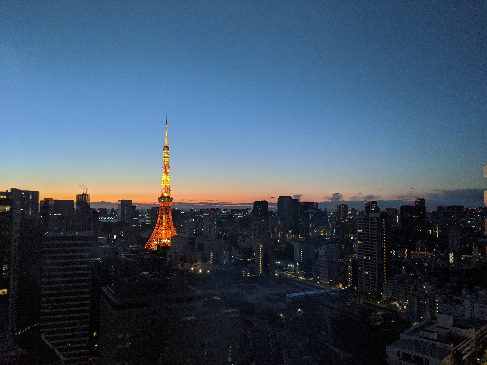
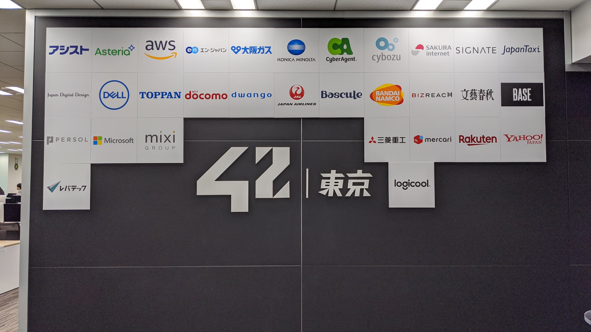

6月末に入学して3ヶ月経過しました。10月初旬に脱退です。

## 42 で学んだこと

本当の意味でのダイバーシティで、カオス、実力主義、最高に楽しかった。

### 入学経緯
42Tokyoを知ったのは合同会社DMMが発表したPRTimesの記事だった。

「教師が付かない完全無料のプログラミングスクール」

学生エンジニアとして、今ひとつ技術が身につかないジレンマに囚われていた私は将来に不安を感じていた。

「今後エンジニアと生きていくのであればアルゴリズムはもちろん、変化の早い世界で生きていく力が必要だ。このままでは今までのアドバンテージが価値を発揮しない」

そんなときに、たまたまPRTimesの話題のプレスリリースで見つけたのが[DMMが42Tokyoを設立する](https://prtimes.jp/main/html/rd/p/000003451.000002581.html)という記事だった。

完全無料、教師なし、プログラミングスクールの形を大きく変えるプロジェクトを目の当たりにして心がざわついたことを今でも覚えている。

#### 一次適性検査

一次適性検査はWeb上でロジックパズルを解いた。雪が降りそうな天気の中こたつにコーヒーをセットして夕方試験を受けた。リサーチしていた情報によるとLv10を超える辺りがボーダーとのことだったので時間を横目に脈早く解いた記憶がある。

一次適性検査の合格通知を受けたあとにPiscineとなるが、ここでもう1段階試練があった。

Piscineの日程だ。

1月試験は満員、2月と3月がかろうじて空いている状況だったので3月に応募した。数日後、試験後のことを考える時間がほしかったので2月に再エントリーした。すでに満員となっており300人待ちの状況だった。

日に日に減っていく人数、12月末に300人の参加キャンセルを経て2月Piscineへの参加が確定した。

#### Piscine

広島に住んでいたので東京移動し、Piscine開始2日前に Timee の小川社長と飲む機会があった。「優秀なエンジニアがいるのであれば欲しい。プロダクトが今後もっと大きくなる。エンジニアは必要不可欠だ」こんな言葉を話していた気がする。

Piscine前日、寝坊は絶対にしたくなかったので六本木のカプセルホテル「Binemu」に宿泊した。Piscine初日の朝食はグラウンドタワー1Fのタリーズでコーヒーとサンドイッチを食べた気がする。

難しいPiscineとは聞いていたが、そうは言っても実際にプロダクトを作った経験があったのである程度すんなり解けるだろうと考えていた……

いや、違う。めちゃくちゃ難しかった。

満員電車には乗りたくなったので昼に登校し、夜は終電間際に帰宅する生活を続けた。

最低限のルールだけが存在し、とりあえず「やってみてください」と言われる。初めは厳しい生活だったが、気がつけばその環境を楽しんでいる自分がいた。

2月後半、コロナが本格的に騒がれ始めた。マスクこそしていなかったが、手を洗う回数を増やしキーボードやマウスを消毒していた記憶がある。  
ちなみに2月後半に Perfume の東京ドーム公演に行った。アリーナ席前列ステージ前13列目という最高のポジションをRushのレビューがあったおかけで遅れて入場した笑。
次の日の公演は中止になった。

Piscine も中止になるかと不安だったが、なんとか終了。Exam終了後にみんなで飲みに行った。2次会はカラオケ、3次会は居酒屋、4次会はバー、5次会はうどん。6次会はグラウンドタワーで入り口のゲートにカードが反応しないことを確認した。

3月初旬、広島の実家で合格の連絡を受けた。

その後コロナの感染が拡大。4月の開校は延期。先行で開始したプロジェクトに参加したが、Piscineを知っているからこそオンラインの42は物足りない部分があった。

### 入学試験が一番重要

6月末に入学して、最初のカリキュラムをなんとかクリアした。ふとここで Piscine について考えた。膨大な時間を利用して強制的に自分をアップグレードするPiscine。もっとも重要なことは「検索」だと考えている。

Piscine で学んだ本当の検索方法、正規表現を利用するとかではなく、物量。通ったあとには草も生えないほど圧倒的に調べ尽くすことの重要性。気力が尽きるまで検索して惰性でプログラムを書ききる。尽き果てたらトイレ休憩。

この熱中度合いを教えてくれたのが Piscine だった。Piscine で熱中することを学ばなければ42のCursusを超えることはできないのだろう。

### 日本の "42”

42の Cursus ではBH（ブラックホール）システムがある。BHに吸い込まれるとフランスではPiscineからやり直し、日本では"いまのところ"二度と復帰することはできない。

このシステムは全世界で稼働しているがフランスのバッファーでは「あまりにも緩すぎる」ということで、42Tokyo では短いバッファーが設定してある。

入学後の最初のカリキュラムは特に問題とならなかったが、次のカリキュラムは難易度が段違いに異なっていたこともあり、学生間で論争が勃発したり…

また、設立して日が浅く、1期生での入学だったため先輩がいない。文化を構築していく面で1月Piscine性や2月、8月生で衝突することも多々あった。ツールの使い方は放置すればカオスになり、学習を阻害する要因となるためルールや制度化は必要だろう。ただ、オープンスペース・有益性を求めすぎるあまりに個人の空間が全く無いのも難しいところではある。

現在は Discode + 42Git での運用となっているが、Discode が通話以外の面で利用しにくいところが多々ある。Slack社に協賛になっていただきたいな～と思ったり。

## 42Tokyoに参加する方法

42Tokyo に参加したい人はホームページから応募が出来ます。

[https://42tokyo.jp/](https://42tokyo.jp/)

とりあえす“やってみてください”。最高に楽しいので。

## 最後に

このような恵まれた環境で学習することができたこと、本当に嬉しく思う。残念ながら私生活の変化と現在の状況、学習能力、それぞれが影響した結果10月初旬に脱退となる。

42での生活は学生資金力乏しい私でも公平に与えられたチャンスであり、背景の異なる「同じ意志を持つ」複数の人と触れ合える最初の機会だった。

42で学んだ「検索の力」「本物の熱中」「スケジューリング」「コミュニケーション」すべてが今後のギアを早めてくれると確信している。

とはいえ能力不足で敗退するのでなんとも言えないのですけども、、、

---

話しかけてくれた人、話に乗ってくれた人、スタッフの皆さん、bnjiroさん、亀山理事長  
最高に楽しい、カオスでダイバーシティな生活を体験できて楽しかったです。42の理想を私では実現できませんでしたが、今後優秀な人を排出してください。
