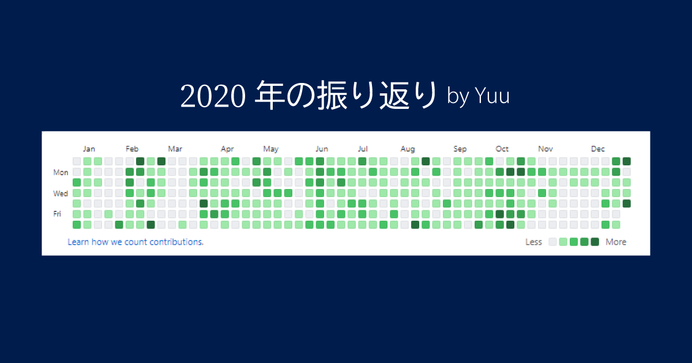

2020年も終わるので反省も兼ねて振り返ってみようと思います。

## 雑観

今年といえば新型コロナだろう。大学は休校になり、技術系セミナーやカンファレンス、チケットを購入して飛行機まで予約していた[「Google I/O 2020」も中止](https://twitter.com/psnzbss/status/1234989188316946432?s=20)に。

大学が無く暇だったこともあり、[生活を習慣化](https://blog.ue-y.me/springvacation2020/)しオムライスと卵の扱いに慣れたり。

そんなコロナ禍の前2月には42Tokyoの選抜試験 Piscine に参加しました。42に対する気持ちは[「42Tokyoに入学して3ヶ月経ちました」](https://blog.ue-y.me/42tokyo/)の記事で書いています。

ウィルスのせいで計画が大きく変化したが、結果としてチャンスに全力でベッドできる年だったと考えている。

## OKR
2019年1月1日に今年の目標を公開しました。
https://twitter.com/psnzbss/status/1212072605777182723?s=20

- Django製サービスをデプロイ
- アウトプットを増やす(月3更新)
- インターンで攻める
- 企業訪問も攻める
- ポートフォリオの更新
- ビジネス/アイデア戦略を作る
- エンジニア友達増やす
- 収入源増やす
- 減量と筋トレ

達成、、、もちろんしましたよ。

### Django製サービスをデプロイ
○：実施  
Django製のアプリをデプロイする予定でしたが、ソーシャル的にグレーなサービスになりそうだったので、クローズ公開にしました。

先日参加したハッカソンでGolangを利用したアプリケーションを公開しました。  
URL：https://ema-generator.herokuapp.com/

### アウトプットを増やす(月3更新)
×：14本  
ブログを新しくしたので開発がメインになってしまったことと、就活がかなり忙しいため更新が出来ず結果として14本の公開となった。

来年は倍以上公開したいお気持ちです。

### インターンで攻める
○：インターン攻めました。
- ソフトバンク
- DMM
- メドレー

それぞれ異なるドメイン・業務内容でしたが、自分の目標とする企業がどういったものなのか明確化できました。

### 企業訪問も攻める
△：コロナによって広島からほとんど出てないので企業訪問はしてないです。

ただし、2月の42Tokyoが開始するまえにTimeeeの小川代表とお話できました。

### ポートフォリオの更新
○：ポートフォリオをTailwindCSSを利用して作りました。

### ビジネス/アイデア戦略を作る
○：2月の東京生活中に 株式会社Gaiax が主催する FUTUREPROOF "BootCamp" に参加した。

採用とはならなかったが、基本的な前提(お金を出すのは誰なのか、利用者はだれか)をより意識するようになった。

### エンジニア友達増やす
○：インターンを通じてかなり増えました。  
困ったときはお世話になっています。ありがとう！！

### 収入源増やす
△：ほぼ変化なし  
インターンで臨時的には増えたものの、継続的な収入増加にはなっていない。

### 減量と筋トレ
×：すみません +3kg してしまいました。就活を終えると決めた瞬間から減量+筋肉増量します。

## 印象に残ったイベント
何と言っても 42Tokyo Piscine です。

圧倒的な熱量と精神をギリギリまで削りながら1ヶ月コミットし続けたあの日々は忘れることが出来ないです。

詳しくは[「42Tokyoに入学して3ヶ月経ちました」](https://blog.ue-y.me/42tokyo/)にて。

## SNSコミット記録
TwitterとGithubをひたすら使いまくった一年間でした。

- Twitter
    - Tweet：1,052
    - Impression：459,823 
- Github：
    - Contribution：1,777

来年はTwitterを見る時間を減らして開発に集中していきたいお気持ちです。

## 2021年はこんな年にしたい
何はともかく、就活に区切りをつけます。  
気になる企業や事業は多々あるものの、私のしたいことができるのか、できないのか。色々と悩んでいますが1月末のは決断して終わります(たぶん)

残りの時間は研究と開発ができればいいなと。  
2021年の目標は[別記事](https://blog.ue-y.me/goal2021/)にて。

2020年、たくさんの人にお世話になりました。来年もよろしくお願いします！！  
ではではノ