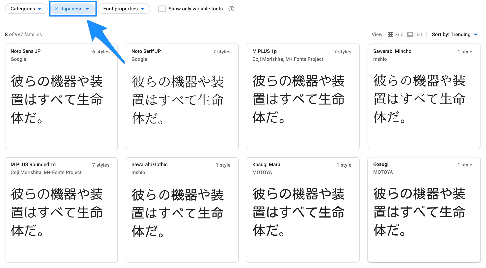
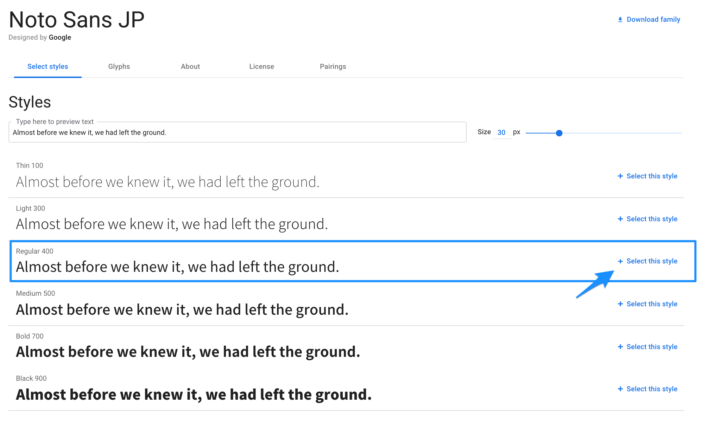
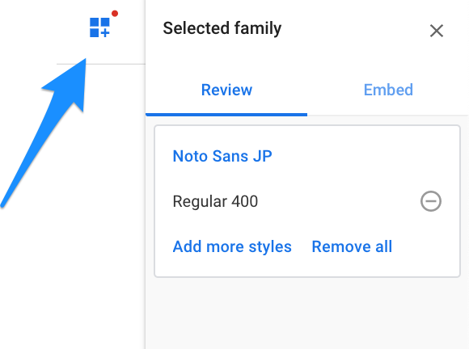
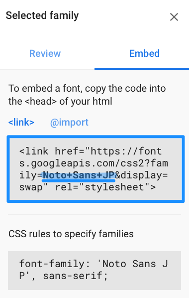
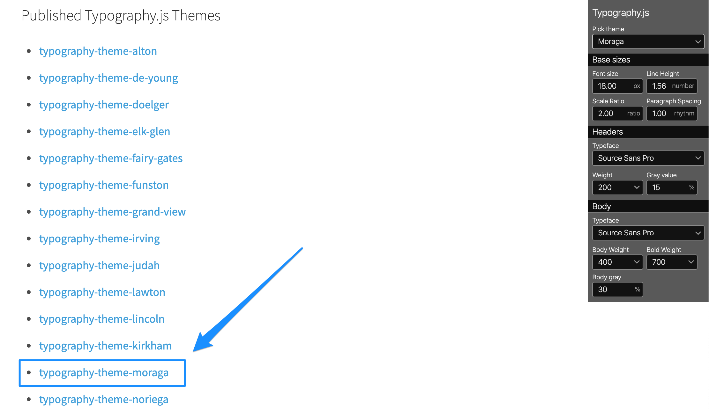

Gatsby.jsは英語圏で作られた静的サイトジェネレーターなので初期は英字フォントが適用されています。いい感じのフォントではありますが、日本語を利用すると違和感の塊なので日本語フォントを適用することにしました。

## Agenda
1. Typography.jsとは
2. 下準備
   1. パッケージのインストール
   2. 日本語フォントを選ぶ
   3. ブログの文字装飾テーマを選ぶ
3. 設置
4. ソースコード

## Typography.js とは
Typography.jsとはブログのイメージを大きく左右するフォント周りの細かい設定をサクッと解決してくれるAPIです。Gatsby.js公式でも推奨しています。

「そんなの利用しない！俺は我流で作り上げる」

というのも不可能ではないですが、Gatsby.jsの特性上非常に面倒な作業となってしまうので、ここではTypography.jsを利用して解決します。

このAPIではフォント周り、文字のsizeやweight, margin, paddingなどを設定してくれます。

## 下準備
### パッケージのインストール
まずはパッケージのインストールを行います。
```bash
# yarnでインストールする場合
yarn add typography gatsby-plugin-typography

# npmでインストールする場合
npm install --save typography gatsby-plugin-typography
```

インストールが正常に完了したら ```gatsby-config.js``` にパッケージ情報を追加します。
```js:title=gatsby-config.js
{
      resolve: `gatsby-plugin-typography`,
      options: {
        pathToConfigModule: `src/utils/typography`,
      },
},
```

```pathToConfigModule``` はTypographyの設定を記入するために用いるファイルのパスを指定します。基本的にはデフォルトで設定されている上記のパスで問題ないです。なにか問題のある人だけ変更してください。

ここまでで、ひとまず基礎は出来上がりました。次に利用するフォントと文字装飾テーマを選択します。

### 日本語フォントを選ぶ
日本語フォントには [Google Fonts](https://fonts.google.com/?subset=japanese) を利用して表示します。 


日本語に限定して表示する


利用するフォントを選択したら、文字の太さを選択する。ここは```Regular```を選びましょう。

選択すると、そのフォントのより詳細なページが表示されます。ここで、利用するフォントのWeightを選択してリンク用コードを表示します。


画面右上のアイコンから選択したフォントを表示できます


Embed(=埋め込む)を選択するとコードが表示されるので、青いマーカーの引いてある部分をコピーします。

### ブログの文字装飾テーマを選ぶ
次に利用する文字装飾テーマを選びます。この部分は利用したくない人はスキップでも構いません。

Typography.js には表示確認用のサイトが用意されています。このページを利用してテーマを決めます。

https://kyleamathews.github.io/typography.js/


右側のメニューからテーマを選ぶことができます。


テーマの配布先(Github)に移動します。

※なぜか配布先が表示されていないテーマがあります。

今回は```moraga```というテーマを利用します。  
npmでのインストール方法はReadmeに書いてあることを参照しながらします。

```bash:title=bash
npm install --save typography typography-theme-moraga
```

## 設置
あとはサクッと設置すれば終了です。

```js:title=typography.js
import Typography from "typography"
import Theme from "typography-theme-moraga"

Theme.googleFonts.push({
// Noto Sans JP フォントを利用する
  name: "Noto+Sans+JP",
  styles: ["400"],
})
Theme.bodyFontFamily = ["Noto Sans JP", "Roboto", "serif"]
const typography = new Typography(Theme)

// Hot reload typography in development.
if (process.env.NODE_ENV !== `production`) {
  typography.injectStyles()
}

export default typography
export const rhythm = typography.rhythm
export const scale = typography.scale

```

テーマ使って修正したい場合はcss書いて修正します。方法はまた別の記事にでも載せます....

## ソースコード
[https://github.com/psbss/yuu-blog/tree/master/blog](https://github.com/psbss/yuu-blog/tree/master/blog)

## 参考
[https://qiita.com/MikihiroSaito/items/1ab9d5eeea66a163648b](https://qiita.com/MikihiroSaito/items/1ab9d5eeea66a163648b)