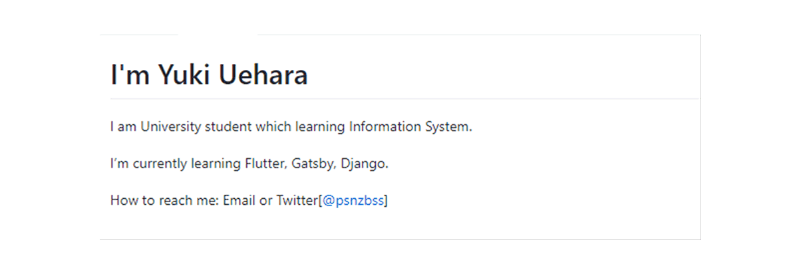
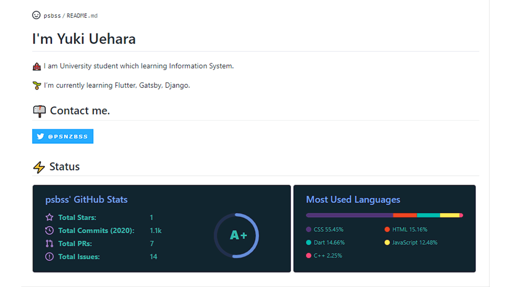
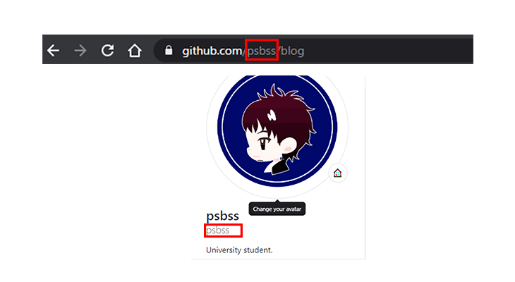
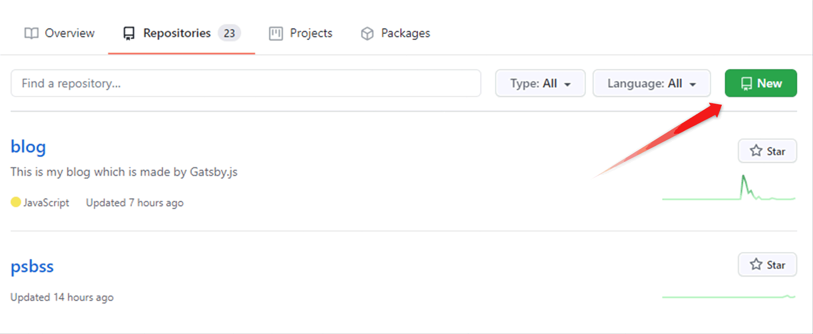
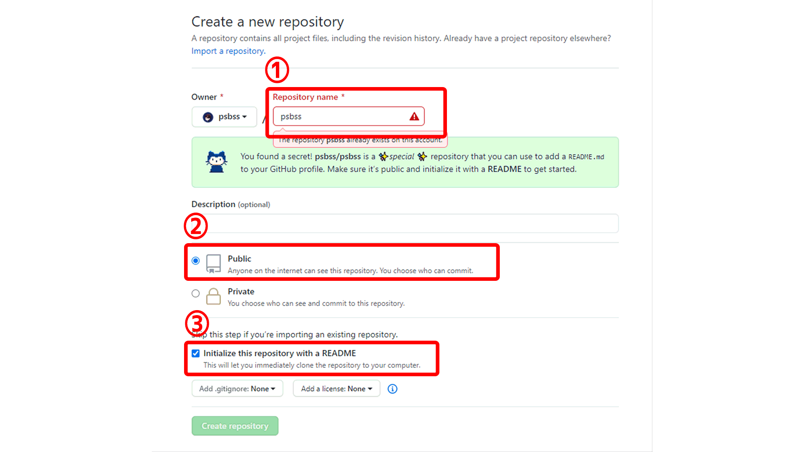
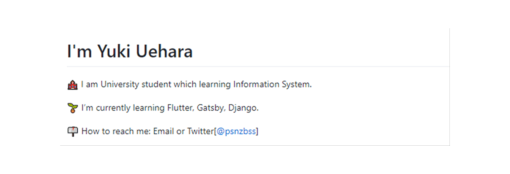
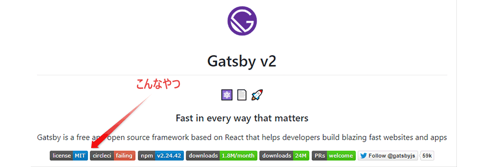
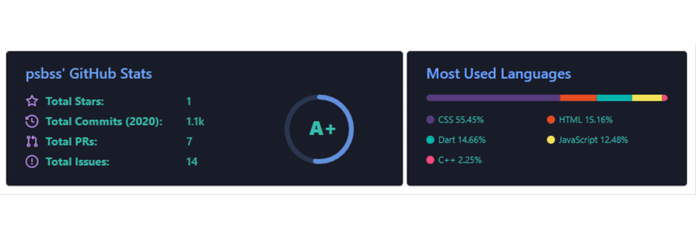

さて、いきなりですがGithubにプロフィールページ機能が追加されたことはご存知ですか？

アカウントのトップページをマークダウンで自由にカスタマイズすることができるんです！

とはいっても、文字だけで作ると・・・



...だせぇぇぇ

ってことになるので、もっとイケてるデザインにしましょう！

ちなみに、この記事を読むと以下のようなデザインを作ることができます。



## 【準備】プロフィールページを表示するために特殊なリポジトリを作成する

このプロフィールページを作るには特殊なリポジトリを作成する必要があります。といっても非常に簡単なのでパパっと作ります。

1. ユーザ名を確認する
2. リポジトリをユーザ名と同じ名前で作る

以上です。

1のユーザ名の確認はURLかトップページから確認できます。



2リポジトリ作成時は①②③を確認して作成しましょう。




## 【実践】プロフィールページを作る

では実際にデザインしていきます！

### 【その1】絵文字を利用しよう！

脱ダサさその1は絵文字を利用することです。絵文字を利用するだけで一気に印象が良くなります。

例えば連絡先にはポストのアイコンを付ける等ですね。



### 【その2】バッジを利用しよう！

Github ユーザおなじみのバッジを利用してみましょう。バッジを利用すると以下のような感じになります。



バッジの生成には [shields.io](https://shields.io/) というサービスを利用します。使い方は詳しいブログがあったので割愛します。

--> 参考：[shields.ioで技術系のアイコンをたくさん作ってみる](https://tech-blog.s-yoshiki.com/entry/150)

### 【その3】リポジトリデータから動的画像を生成しよう！

本日のメインテーマがこちら、リポジトリのデータを拾ってきて動的に画像を生成するサービスです。このサービスを利用すると常に最新のデータで以下のような画像を生成してくれます。



これは [GitHub Readme Stats](https://github.com/anuraghazra/github-readme-stats) というサービスを利用して作成しています。この画像を設置するだけでGithubのプロフィールページが一気に強くなるのでおすすめです。

#### 設置方法

README.md に以下の画像リンクを設置します

```README.md
<!-- リポジトリステータス -->
[](https://github.com/ユーザ名/)

<!-- ソースコード統計 -->
[](https://github.com/ユーザ名/)
```
それぞれオプションを設定しています。オプションはGitHub Readme Statsのリポジトリに説明が載っています。

私の場合は

- コントリビューター数非表示
- プライベートリポジトリのコミット数を含める
- アイコンの表示
- テーマはTokyonigh

にしてみました。


## まとめ


- Github にプロフィールページ機能が追加されたよ
- イケてるプロフィールはかっこいいよ
- GitHub Readme Stats は設置必須だよ！

余談：近々カウンターも設置しようかなと悩んでいます。。。

## Links

- [Github](https://github.com/psbss)
- [Shields.io](https://shields.io/category/build)
- [GitHub Readme Stats](https://github.com/anuraghazra/github-readme-stats)