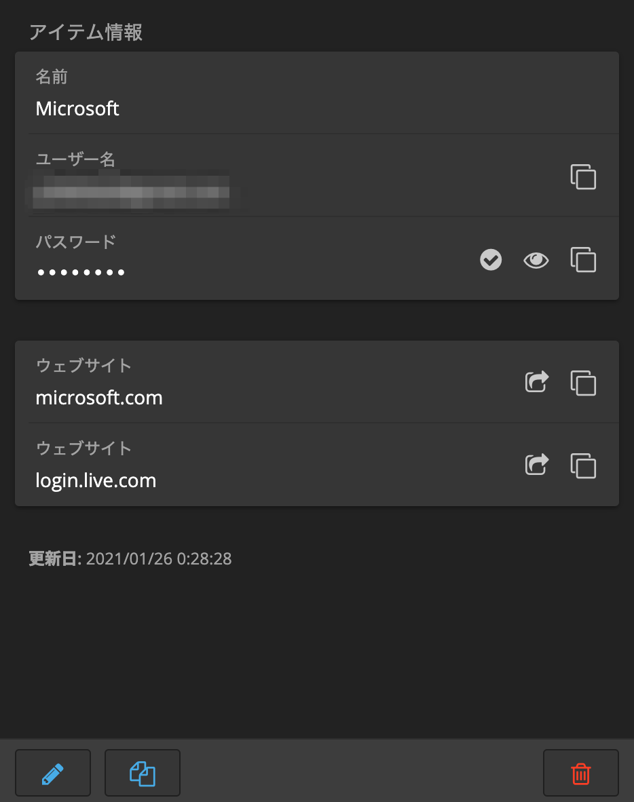
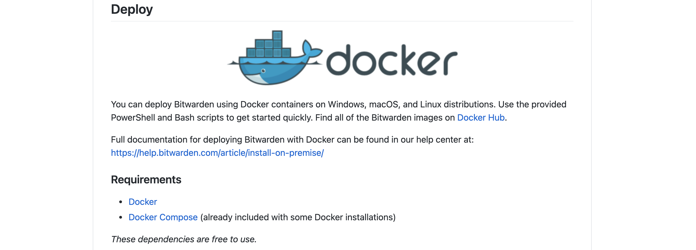
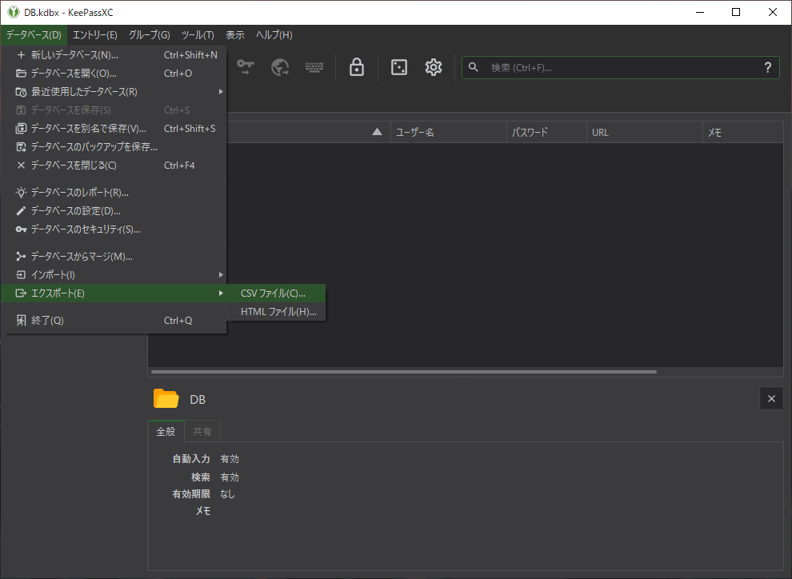
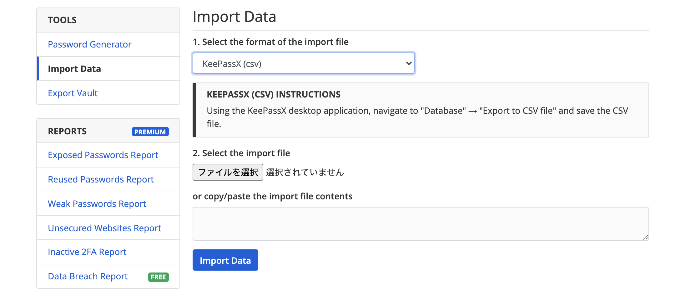

こんにちは。友人のセキュリティ意識向上に全力の上ちょ([@psnzbss](https://twitter.com/psnzbss))です。

今回は全人類利用必須のツールだと考えているパスワードマネージャについての話です。  
最近、長年利用していたKeePassからBitwardenに浮気(乗り換え)したので使ってみた感想と簡単な移行方法について書いていきます。

なお、当方セキュリティ意識は高くても専門ではないので「いやそれ危ねえよ」などのツッコミはツイッターでリプして頂けますとありがたいですm(__)m

※ 特筆が無い限り当記事のBitwardenは無料版を指します。企業用・家族用ではありません。

## パスワードマネージャってなんやねん

ざっくり簡単に説明すると「ID・パスワード・サービスURLをメモった紙を大量に入れた金庫」です。

アナログなやり方だと上記の方法を実際にやっている会社もあると思います。

> 物理的にこじ開けられたら危なくないですか。  
> メモ書きだとゼロ0と大文字ののオーOと小文字のオーoの判別難しいくないですか。  
> いちいち手入力するのは面倒じゃないですか。  
> 結局ブラウザに記憶させて会場してませんか。

こういった問題や利便性の低さを一瞬で解決してくれるのがパスワードマネージャです。

## パスワードマネージャの種類と無料で利用できるサービス

パスワードマネージャにも種類があって、大きく分けるとローカル型とクラウド型があります。

ローカル型はパスワードをローカル上のディスクに暗号化して保存します。そのため、障害などでファイルにアクセスできなくなると詰みます。  
ただし、適切な管理を行えば流出する可能性はほとんどありません。

ローカル型のパスワードマネージャは以下のようなサービスがあります。

- KeePass
- Enpass
- Sticky Password

クラウド型はパスワードをクラウドに保存します。障害などでデータが吹き飛ぶ可能性はローカル型に比べると低いですが、クラッキングにより、保管庫(暗号化済みパスワード)が流出する可能性があります。しかし、利便性を考えるとクラウド型パスワードマネージャのほうが優れていることが多いです。

クラウド型のパスワードマネージャは以下のようなサービスがあります。

- Bitwarden
- 1Password
- LastPass
- Dashlane
- KeePer

2種類のサービスのなかでも基本無料(無制限パスワード保存)なサービスは以下です。

- ローカル型
  - KeePass
  - Sticky Password
- クラウド型
  - Bitwarden
  - LastPass

## KeePassからBitwardenに乗り換えた理由

KeePassを約6年利用しましたが、利便性が悪い部分がいつまで経っても改善されため移行しました。

### KeePassの種類とイマイチな部分

利便性の悪い部分は後ほど述べるとして、そもそもKeePassにも色々な種類があり、本家のKeePass、本家を元にクロスプラットフォーム対応をしたKeePassX、KeePassXをさらに使いやすくしたKeePassXCがあります。

本家のKeePassは基本的な機能しか実装していないため、半年ほどで利用を取りやめ、KeePassXCを主に使っていました。

しかし、ローカル型の欠点でもあるクロスプラットフォーム対応しても保管庫を同期(GoogleDrive経由)させるのに時間がかかったり、出先で同期されていないことなどが多々ありました。また、致命傷なのがブラウザのフォーム自動入力が乏しいことです。とにかくパスワードを保存してから自動入力機能を使えるようになるまで手順が多い。

以上のような問題点や利便性を考えた際に、時間があれば他のサービスへ乗り換えたいと考えていました。

就活が[一段落](https://blog.ue-y.me/job-hunting/)したので、アカウント断捨離のついでにパスワードマネージャを移行しようと考えて現在に至ります。

前述のようにKeePassシリーズには利用上無視できない欠点が多数あるので移行先を調べたところ、クラウド型のBitWardenが好評だったので、触ってみました。

### Bitwardenでできること

Bitwardenも一般的なパスワードマネージャではあるので、基本的な動作は他のサービス同様です。

- パスワードの無制限保存
- パスワード生成(利用文字種の指定可能、アルファベット+数字のみなど)
- クロスプラットフォーム対応
- 二要素認証ログイン

以上のような特徴は現代のパスワードマネージャであれば必須機能としてほしい。

- パスワードのシェア
- スムーズなフォーム入力

最近の更新でパスワードのシェア機能が追加された。私のようなLINEなどのメッセージングサービス経由で平文の文字を送信するのが嫌な人には待ちわびた機能でした。

また、パスワードの入力する先は99%がブラウザを利用した入力なのでフォーム入力がお粗末だとストレスになるため、ソフト内で完結してくれる部分はありがたい。

### BitwardenがKeePassより優れているところ

前述の二要素認証やパスワードシェア機能はKeePassよりも優れているが、KeePassはプラグインを導入することで対応することができる。二要素認証なら「[TwoFactorQRCodeReader](https://keepass.info/plugins.html#tfqrcr)」というプラグインが存在します。

KeePassのプラグインや種類を変えても微妙だったのが、「パスワードの同期」と「ブラウザのフォーム入力」です。

#### KeePassはパスワード同期が遅すぎる

KeePass(X, XC)のパスワード同期はファイルそのものをGoogleDriveなどの外部サービスに通常アップロードで保存する方法と、GoogleCloudのAPI経由で直接保存する方法が存在します。

どちらの方法を利用しても同期されるまでに時間がかかってしまい、同期が完了したか確認してからデスクを立ち上がる必要があるなど、ストレスを感じていました。

Bitwardenの場合、クラウド型なので変更後すぐに反映されます。(変更を変えたクライアントからクラウドへ即時反映、他のクライアントで利用する時は場合によって手動同期が必要)この自動Push/Sync機能が地味に便利で、変更し忘れることがなくなりました。

#### ブラウザのフォーム自動入力が強すぎてヤバい

Bitwardenはブラウザのフォーム自動入力にももちろん対応している。しかもChromeブラウザだけでなく、Chromium Edge、Firefox、Opera、Safari、Brave、Torにも対応しています。

OS側はMac、Windows、Linuxにネイティブで対応し、CLIとしてnpmに対応したり、WEBクライアントも完備しています。

このように、クロスプラットフォームに関しては思いつく全ての環境で対応していると言って過言でないでしょう。

肝心のフォーム自動入力ですが、ウェブサイトのURLを“複数”登録することができる点がKeePassシリーズにはなかった点です。これにより、クロスアカウントを採用している大規模サービスなどでもパスワードの登録は一つで、URLだけ増やせば自動入力してくれます。



また、地味に便利なのが、ページを開くとフォームに自動入力してくれますが、この入力までの時間がKeePassに比べると素早く、入力した部分もわかりやすいです。

## Bitwardenに移行した決定点

以上のような強力な機能を有するBitwardenですが、最終的に完全移行する決断をした理由は別にあります。

それは、OSSとして開発されており、開発の頻度も活発であるということと、Dockerイメージが公開されているので個人でサーバを建てることも可能という点です。

BitwardenはOSSとして全ソースコードがGitHub上に[公開](https://github.com/bitwarden)されています。

そのため、比較的に変なコードが仕込まれる可能性は低いと考えられます。またKeePass(X, XC)もOSSでしたが、スター数は1,000に満たないくらいだったので、Bitwardenが6,000オーバーなのは相対的に人気と言えます。

また、Dockerイメージが標準で提供されているので、企業や個人でパスワードを外部サーバにアップロードしたくない人は簡単に自前のサーバを建てることも可能です。



以上が私がBitwardenをオススメする理由です。

## 実際にKeePasssから移行する方法

※ Bitwardenのアカウントは作ってある前提です。

まずはKeePassのパスワードを出力します。```データベース → エクスポート → CSVファイルとしてエクスポート```これだけです。暗号化されていないファイルなので、流出すると一瞬で死にます。気をつけてください。



Bitwardenの操作はWEBクライアントで行います(分かりやすいため)。WEBクライアント[https://vault.bitwarden.com/](https://vault.bitwarden.com/)をまず開き、ログインしてツールを開きます。

次に、フォーマットを```KeePassX```に指定し、先程KeePassからエクスポートしたファイルをインポートすれば完了です。



作業が終わったらKeePassからエクスポートしたファイルは確実に削除してください。

以上のように比較的簡単に移行ができます。私は移行したついでにアカウント断捨離をして、約150個のサービスから退会しました。
